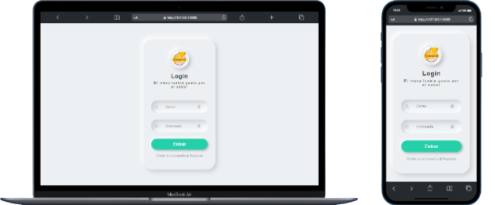

# Página de Inicio de Sesión - HTML

Este archivo HTML representa una página de inicio de sesión diseñada específicamente para una página web relacionada con comida. La página proporciona un formulario donde los usuarios pueden ingresar su correo electrónico y contraseña para acceder.

 

    
# Contenido

   - [Características Destacadas](#características-destacadas)
   - [Contenido Principal](#contenido-principal)
   - [Instrucciones de Uso](#instrucciones-de-uso)
   - [Contribución](#contribución)

## Características Destacadas

- **Formulario de Inicio de Sesión**: Incluye campos para el correo electrónico y la contraseña, con validaciones de entrada.

- **Enlaces Adicionales**: Ofrece enlaces para restablecer la contraseña y registrar una nueva cuenta.

- **Iconos**: Utiliza iconos SVG para mejorar la experiencia visual.

## Contenido Principal

- **Estructura HTML**: El archivo sigue las mejores prácticas de estructura HTML con elementos como `<!DOCTYPE>`, `<html>`, `<head>`, `<meta>`, `<title>`, `<body>`, etc.

- **Formulario de Inicio de Sesión**: El formulario utiliza el método POST para enviar datos a un destino especificado en el atributo `action`.

- **Estilos**: Se hace referencia a una hoja de estilo externa ("login.css") para aplicar estilos a la página.

## Instrucciones de Uso

Para utilizar este archivo HTML en tu proyecto:

1. Clona o descarga el repositorio que contiene este archivo HTML.

2. Asegúrate de que los enlaces a las hojas de estilo y los scripts sean correctos y que los archivos estén ubicados en las rutas especificadas.

3. Personaliza el contenido, los enlaces y la lógica del formulario según las necesidades específicas de tu proyecto.

4. Asegúrate de proporcionar una página de destino adecuada en el atributo `action` del formulario (`<form action="index.html">`) para procesar los datos del formulario correctamente.

## Contribución

Si deseas contribuir o mejorar este archivo HTML:

1. Haz un fork del repositorio.

2. Realiza tus cambios y mejoras en tu propio fork.

3. Envía un pull request para que tus cambios sean revisados y, si se aprueban, se fusionen con el repositorio original.
